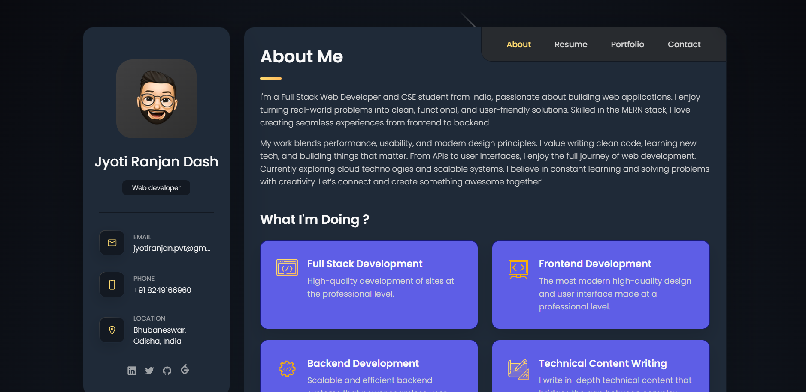
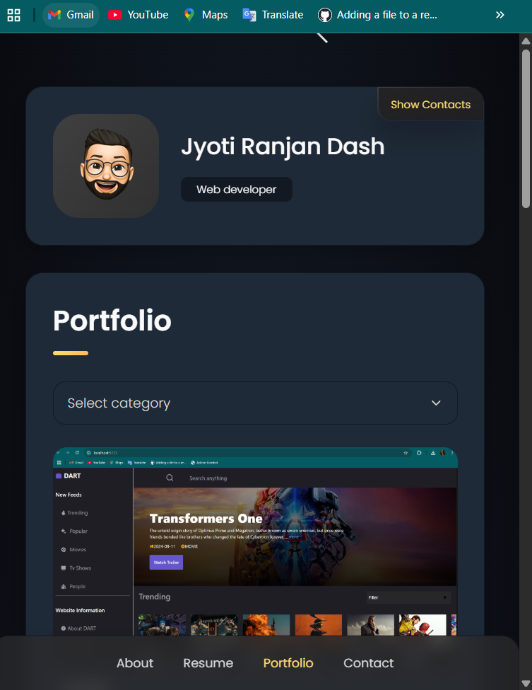

# Jyoti RANJAN DASH - Personal portfolio


!

This is a fully responsive personal portfolio website, responsive for all devices, built using HTML, CSS, and JavaScript.

## Demo




## Prerequisites

Before you begin, ensure you have met the following requirements:

* [Git](https://git-scm.com/downloads "Download Git") must be installed on your operating system.

## Installing Portfolio

To install **my Portfolio**, follow these steps:

Linux and macOS:

```bash
sudo git clone https://github.com/ripper06/Jyoti-Ranjan-Dash-Portfolio
```

Windows:

```bash
git clone https://github.com/ripper06/Jyoti-Ranjan-Dash-Portfolio
```